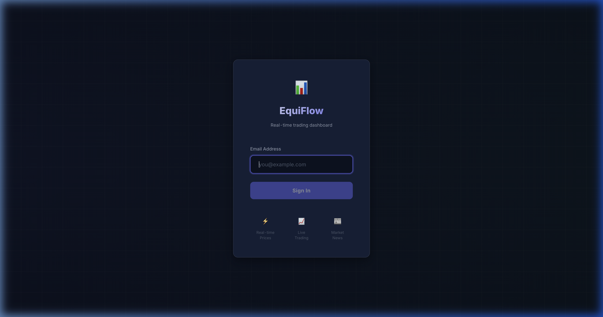
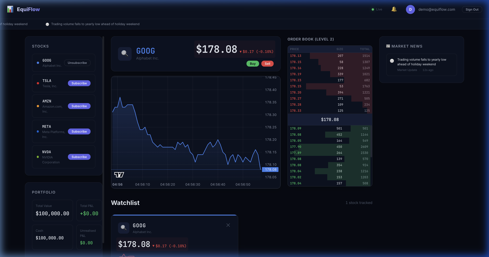

<p align="center">
  <strong>📊 EquiFlow</strong>
</p>

<p align="center">
  <em>Real-Time Stock Trading Dashboard</em>
</p>

<p align="center">
  
  
  
  
  = 18" />
  
</p>

---

**EquiFlow** is a production-grade, real-time stock broker dashboard that simulates live market data using Geometric Brownian Motion (GBM). Built with a modern React 19 front-end and a Node.js/Express + Socket.IO back-end, it delivers a premium dark-themed trading terminal experience inspired by professional platforms like Bloomberg Terminal and Robinhood.

The application streams simulated stock prices in real time over WebSockets, renders interactive candlestick charts via TradingView's Lightweight Charts library, and provides a fully functional order book with animated bid/ask depth. Users can place market and limit orders, track their portfolio performance with live P&L calculations, and stay informed through an auto-generated market news feed — all within a sleek, glassmorphism-styled UI with smooth micro-animations.

EquiFlow is designed as a comprehensive full-stack showcase covering real-time data pipelines, WebSocket pub/sub architecture, financial data visualization, state management, and responsive design — making it ideal for learning, demos, or as a foundation for production trading interfaces.

## 📸 Screenshots

### Login

<p align="center">
  
</p>

### Trading Dashboard

<p align="center">
  
</p>

## ✨ Features

| Category | Highlights |
|---|---|
| **Live Market Data** | Real-time price streaming via WebSocket with GBM-based simulation |
| **Interactive Charts** | Candlestick & area charts powered by Lightweight Charts + Recharts |
| **Order Book** | Live bid/ask depth visualization with animated updates |
| **Trading Panel** | Place market & limit orders (buy/sell) with instant portfolio updates |
| **Portfolio Tracker** | Track holdings, P&L, allocation breakdown, and trade history |
| **Market News** | Auto-generated financial news feed with sentiment indicators |
| **Notifications** | Toast-style alerts for trade confirmations and market events |
| **Authentication** | Session-based login with persistent local storage |
| **Dark Terminal UI** | Glassmorphism, micro-animations, and a sleek Bloomberg-inspired design |

## 🏗️ Architecture

```
equiflow/
├── client/                 # React + Vite front-end
│   ├── src/
│   │   ├── components/     # UI components
│   │   │   ├── ActiveAsset/
│   │   │   ├── Dashboard/
│   │   │   ├── Login/
│   │   │   ├── NewsFeed/
│   │   │   ├── Notifications/
│   │   │   ├── OrderBook/
│   │   │   ├── Portfolio/
│   │   │   ├── SparklineChart/
│   │   │   ├── StockCard/
│   │   │   ├── StockChart/
│   │   │   ├── StockSubscriber/
│   │   │   ├── TradingPanel/
│   │   │   └── common/
│   │   ├── context/        # React context (Auth)
│   │   ├── hooks/          # Custom hooks
│   │   ├── services/       # API & WebSocket clients
│   │   └── utils/          # Formatters & helpers
│   └── index.html
│
├── server/                 # Node.js + Express back-end
│   └── src/
│       ├── config/         # Environment & app configuration
│       ├── middleware/      # Auth, rate-limiting
│       ├── models/         # In-memory data models
│       ├── routes/         # REST API routes
│       ├── services/       # Simulation engine, news generator
│       ├── socket/         # Socket.IO manager & pub/sub
│       └── validators/     # Request validation (Joi)
│
└── package.json            # Root orchestrator (concurrently)
```

## 🚀 Getting Started

### Prerequisites

- **Node.js** ≥ 18.0.0
- **npm** ≥ 9

### Installation

```bash
# Clone the repository
git clone https://github.com/psk1000000/EquiFlow.git
cd equiflow

# Install all dependencies (root, server, and client)
npm run install:all
```

### Running in Development

```bash
npm run dev
```

This starts both the **server** (port `3001`) and the **client** (port `5173`) concurrently.

| Service | URL |
|---|---|
| Dashboard | [http://localhost:5173](http://localhost:5173) |
| REST API | [http://localhost:3001/api](http://localhost:3001/api) |
| WebSocket | `ws://localhost:3001` |
| Health Check | [http://localhost:3001/api/health](http://localhost:3001/api/health) |

### Building for Production

```bash
npm run build
```

The production-optimized client bundle is output to `client/dist/`.

## 🔌 API Reference

### Authentication

| Method | Endpoint | Description |
|---|---|---|
| `POST` | `/api/auth/login` | Login with email & password |
| `POST` | `/api/auth/logout` | End session |

### Stocks

| Method | Endpoint | Description |
|---|---|---|
| `GET` | `/api/stocks` | List all available stocks |
| `GET` | `/api/stocks/:symbol` | Get details for a specific stock |

### Trading

| Method | Endpoint | Description |
|---|---|---|
| `POST` | `/api/trades/order` | Place a buy/sell order |
| `GET` | `/api/trades/history` | Retrieve trade history |
| `GET` | `/api/portfolio` | Get current portfolio & holdings |

### WebSocket Events

| Event | Direction | Description |
|---|---|---|
| `subscribe` | Client → Server | Subscribe to a stock's live feed |
| `unsubscribe` | Client → Server | Unsubscribe from a stock's live feed |
| `price_update` | Server → Client | Real-time price tick |
| `order_book` | Server → Client | Order book depth snapshot |
| `news` | Server → Client | Market news item |
| `trade_confirmation` | Server → Client | Order fill notification |

## 🛠️ Tech Stack

### Front-End

- **React 19** — UI framework with hooks & context API
- **Vite 8** — Lightning-fast dev server & bundler
- **Lightweight Charts** — High-performance candlestick charts (TradingView)
- **Recharts** — Composable charting library for sparklines & portfolio charts
- **Socket.IO Client** — Real-time bidirectional communication

### Back-End

- **Express 4** — Minimal, flexible web framework
- **Socket.IO** — WebSocket server with room-based pub/sub
- **Helmet** — HTTP security headers
- **Compression** — Gzip response compression
- **Joi** — Schema-based request validation
- **Morgan** — HTTP request logging
- **UUID** — Unique trade/order ID generation

## 📝 Scripts

| Script | Description |
|---|---|
| `npm run dev` | Start server + client concurrently |
| `npm run dev:server` | Start only the back-end |
| `npm run dev:client` | Start only the front-end |
| `npm run build` | Build the client for production |
| `npm run install:all` | Install dependencies for root, server, and client |

## 🤝 Contributing

1. Fork the repository
2. Create a feature branch (`git checkout -b feature/amazing-feature`)
3. Commit your changes (`git commit -m 'Add amazing feature'`)
4. Push to the branch (`git push origin feature/amazing-feature`)
5. Open a Pull Request

## 📄 License

This project is licensed under the **MIT License** — see the [LICENSE](LICENSE) file for details.

